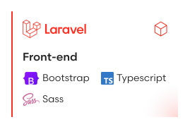

<h2>  Hi, I'm Sofiane !</h2>

[](https://www.linkedin.com/in/sofiane-lasri-trienpont/)
[](https://gitlab.sl-projects.com/sl-projects/sl-projects-website)
[![GitLab: My GitLab](https://img.shields.io/badge/SofianeLasri.fr-F78E57?logo=data:image/svg%2bxml;base64,PHN2ZyB4bWxucz0iaHR0cDovL3d3dy53My5vcmcvMjAwMC9zdmciIHdpZHRoPSI0MTMiIGhlaWdodD0iMTcxIiB2aWV3Qm94PSIwIDAgNDExLjgyIDE2OS4zMiI+PGcgZmlsbD0iI2ZmZmZmZiI+PHBhdGggZD0iTTIwNS41MyAwYy02LjEyIDI2LTIyLjY5IDM2LjcyLTQ5LjQ3IDM2LjcySDU3LjYzYy0yMi43IDAtNDguMiA2LjEyLTU1Ljg1IDMwLjM0QTQ5LjIzIDQ5LjIzIDAgMDEwIDU0LjU3di0zLjgzQzAgMjIuNDQgMjYuNzcgMCA1MC40OSAwem0uNzcgMTE5LjM0YzAgMjkuMzMtMjYuNzggNTAtNTAuNzUgNTBINTAuNDljLTIxLjQyIDAtNDUuMzktMTUuMy00OS43My0zNi43MkgxNDBjMTQuNzkgMCAxNC0xMy43NyAxNC0xMy43N3YtLjUxYzAtNC4wOC0uNTEtMTMuMjYtMTQtMTMuMjZINTAuNDljLTEyLjc1IDAtMjcuNTQtNS42MS0zNi4yMS0xNi4wN2EyNC4xIDI0LjEgMCAwMS0zLjMyLTEyYzAtMjAuNjYgMjQtMjkuMDcgNDEuNTctMjkuMDdhMTEuMiAxMS4yIDAgMDAtLjI2IDIuOHYzLjgzYzAgMy41Ny4yNiAxMy43NyAxMy43NyAxMy43N2g4OS41MWMyOS4wNyAwIDUwLjc1IDI0LjQ4IDUwLjc1IDUxek0yMjYuNjkgODcuOTdWMGg1MnYxMjEuMzhoLTEzLjVjLTIyLjQ0IDAtMzUuMTktMTEuMjItMzguNS0zMy40MXptMTg1LjEzIDQ0LjYzYy0xLjUzIDE1LjgxLTE2LjMyIDM2LjcyLTQyLjMzIDM2LjcyaC0xNDIuOHYtNTIuNzhjMTEgMTMgMjcgMTUuODEgMzguNSAxNi4wNnoiLz48L2c+PC9zdmc+&logoColor=white&link=https://sofianelasri.fr)](https://sofianelasri.fr)

I am a Full-Stack web developper at [Kang.fr](https://kang.fr/) during the week, and an all-language programmer at the weekend. 😄

<h3> About me...</h3>

```php
$sofianeLasri = [
    "code" => ["PHP", "Javascript (and TS)", "CSS (and SCSS)", "Java", "C#"],
    "technologies" => [
        "frameworks" => ["Laravel", "NestJS", "Express.js", "Vue.js"],
        "libraries" => ["Bootstrap", "Sequelize"],
        "databases" => ["MySQL", "Redis"],
        "IDE" => ["VSCode", "IntelliJ IDEA", "PhpStorm", "Rider"],
        "tools" => ["Docker", "Git", "GitLab", "Postman", "Atlassian tools (Jira, Confluence, Trello)"]
    ],
    "sysadmin" => [
        "OS" => ["Debian", "Ubuntu"],
        "services" => ["Apache", "Node.js", "Mariadb", "Redis", "Pterodactyl", "Docker"],
    ],
    "softSkills" => [
        "teamwork", "communication", "problem-solving", "adaptability", "time management"
    ],
];
```

<h3> My prefered stack</h3>




<!--START_SECTION:waka-->
<h3> This Week I Spent My Time On</h3> 

```text
🕑︎ Time Zone: Europe/Paris

💬 Programming Languages: 
PHP                      9 hrs 4 mins        █████████████████████░░░░   82.83 % 
Vue.js                   55 mins             ██░░░░░░░░░░░░░░░░░░░░░░░   08.44 % 
Markdown                 20 mins             █░░░░░░░░░░░░░░░░░░░░░░░░   03.16 % 
Text                     14 mins             █░░░░░░░░░░░░░░░░░░░░░░░░   02.13 % 
Bash                     11 mins             ░░░░░░░░░░░░░░░░░░░░░░░░░   01.82 % 

🔥 Editors: 
PhpStorm                 10 hrs 57 mins      █████████████████████████   100.00 % 
```


<!--END_SECTION:waka-->
